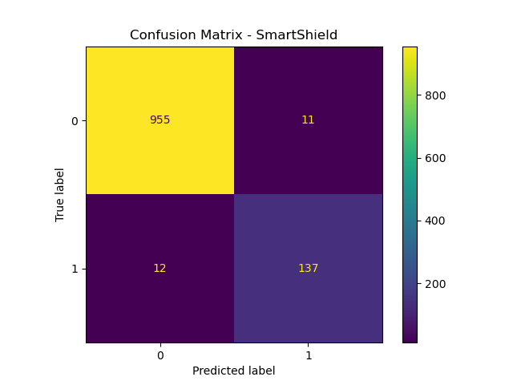

# 🛡️ SmartShield AI

AI-powered Spam Detection System using NLP and Machine Learning.

---

## 📌 Problem Statement
Detect spam messages using Natural Language Processing techniques.

---

## 🚀 Features
- Spam classification model
- Confusion matrix visualization
- Word frequency analysis
- Flask web interface

---

## 🛠️ Tech Stack
- Python
- Scikit-learn
- Pandas
- Flask
- NLP (CountVectorizer)

---

## 📊 Model Performance
Accuracy: ~98%

Confusion Matrix:


---

## ⚙️ Installation

```bash
pip install -r requirements.txt
python app.py